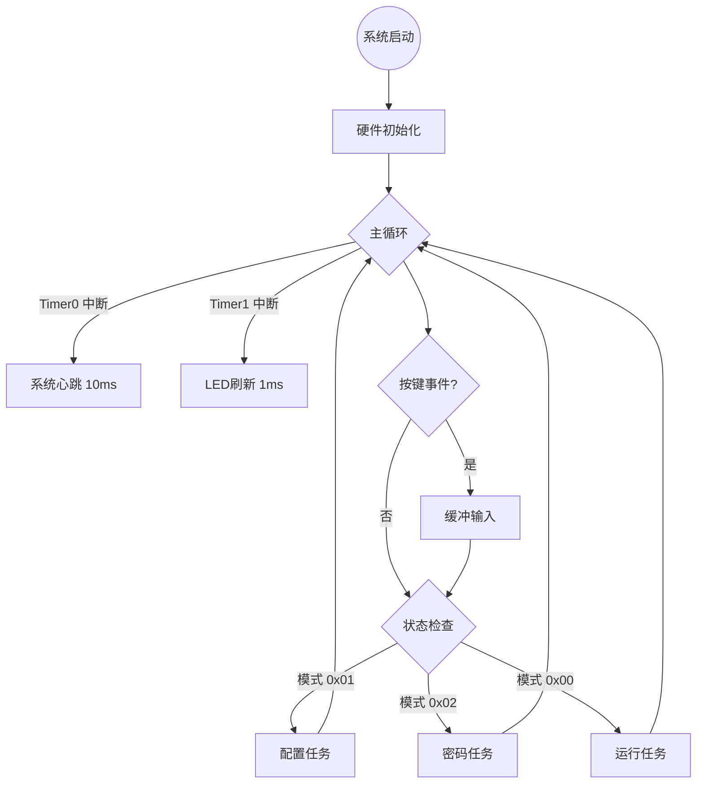
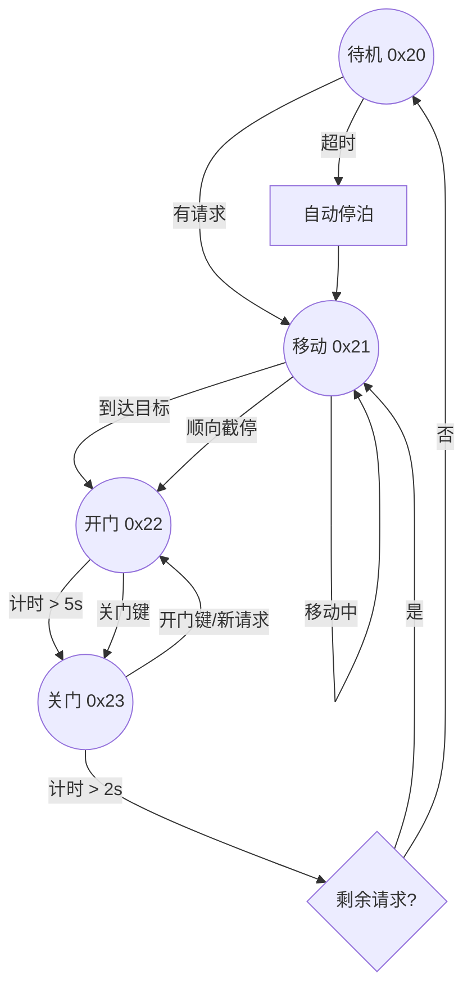

# 单片机期末大作业实验报告

## 一、任务要求

本实验旨在基于 Silicon Labs C8051F020 高性能单片机，设计并实现一个功能完备的多楼层智能电梯控制系统。作业要求学生能够独立完成软硬件资源的规划、驱动开发、中间件设计以及应用层逻辑的编写。

具体系统要求如下：
1.  **基础控制功能**：
    *   构建一个支持 -2F 至 8F 共 11 个楼层的电梯控制模型。
    *   实现电梯的上下行移动、精准停靠、自动开关门控制。
    *   具备内呼（轿厢内选层）和外呼（楼层厅门上下行召唤）的处理能力。
2.  **人机交互设计**：
    *   利用 LCD1602 液晶显示屏实时显示电梯当前运行状态（Running/Open/Close/Idle）及提示信息。
    *   利用 6 位 LED 数码管进行动态扫描，显示当前楼层、运行方向动画及目标楼层。
    *   通过 4x4 矩阵键盘实现楼层选择、开关门控制、模式切换及系统配置。
3.  **软件架构要求**：
    *   采用分层软件架构，明确划分硬件抽象层（HAL）、设备驱动层（Driver）、中间件（Middleware）和应用任务层（Application）。
    *   引入有限状态机（FSM）管理复杂的电梯运行逻辑，确保状态流转清晰可靠。
    *   实现基于时间片轮询的多任务并发处理机制，确保按键扫描、显示刷新与电机控制的实时性。
4.  **资源规划**：
    *   合理分配单片机的定时器资源（Timer0/1/2）以满足系统心跳、显示刷新和蜂鸣器驱动的需求。
    *   规划 RAM 空间地址，建立清晰的全局变量映射表，用于任务间通信和状态保存。

## 二、设计思路

本系统的软件设计采用分层模块化思想与“双层状态机”架构相结合的方式。主程序作为调度中心，协调各模块协同工作。

### 2.1 电梯需要实现的功能

本系统在满足基础载客功能的基础上，引入了多项模拟真实电梯的高级特性：
*   **智能调度算法 (SCAN)**：
    *   采用电梯调度中经典的 SCAN 扫描算法（即“电梯算法”）。
    *   电梯在运行中优先响应当前运行方向上的所有请求（包括轿厢内指令和同向的厅外召唤）。
    *   只有当同向请求全部处理完毕后，才扫描反向的最远端请求，避免电梯频繁换向，提高运输效率。
*   **顺向截停 (En-route Interception)**：
    *   在电梯移动过程中，实时检测途经楼层是否有同向请求。
    *   若检测到有效请求（如上行途经 3 楼时有 3 楼上行请求），系统立即执行截停逻辑，减速并开门接客，无需到达原定目标后再折返。
*   **空闲自动停泊 (Idle Parking)**：
    *   为提升响应速度，系统实现了闲时自动归位功能。
    *   当系统检测到请求队列为空且电梯待机超过一定时间后，根据当前位置自动判断：
        *   若位于低层区（< 4 楼），自动返回 1 楼大堂待命。
        *   若位于高层区（>= 4 楼），自动返回 8 楼待命。
*   **双重交互模式 (Dual Input Mode)**：
    *   **梯内模式 (Inside)**：模拟乘客在轿厢内，按数字键直接录入目标楼层。
    *   **梯外模式 (Outside)**：模拟乘客在电梯厅，操作逻辑为“先选层、后选向”（输入楼层 -> 按 'E' 上行或 'F' 下行）。
*   **防夹与重开门**：
    *   在关门倒计时过程中，若检测到本层有新的呼叫请求或按下“开门键”，电梯立即中断关门动作，重新回到开门状态并重置倒计时。

### 2.2 代码层次详解

本系统的软件架构严格遵循分层设计原则，自底向上严格解耦。

#### 2.2.1 驱动层 (Driver Layer)
驱动层直接操作 SFR（特殊功能寄存器），屏蔽硬件差异，向上提供标准 API。

1.  **LCD1602 显示驱动**：
    *   **难点解决**：C8051F020 的 P4 端口（控制 LCD 的 RS/E 信号）位于 SFR 页 `0Fh`，而标准数据端口 P3 位于页 `00h`。
    *   **实现逻辑**：驱动封装了 `LCD_WR_CMD` 和 `LCD_WR_DAT` 函数。在操作 RS 和 E 引脚的微秒级瞬间，驱动会自动保存 ACC，切换 `SFRPAGE` 到 `0Fh` 修改电平，再立即切回 `00h`，确保上层调用者无需关心分页机制。
    *   **初始化**：完成 8 位总线模式、双行显示、光标隐藏等标准初始化序列。

2.  **LED 数码管驱动**：
    *   **刷新机制**：采用 **Timer 1** 作为独立刷新源，周期设为约 1ms。
    *   **动态扫描**：利用人眼视觉暂留效应。中断服务程序每次仅点亮一位数码管，流程为：`关断段/位选 (消隐)` -> `读取显存` -> `查段码表` -> `查位选表` -> `输出电平` -> `索引自增`。6 位数码管循环点亮频率大于 100Hz，实现无闪烁显示。
    *   **显存映射**：驱动只需读取 RAM `0x28-0x2D` 的内容，解耦了显示逻辑与业务逻辑。

3.  **矩阵键盘驱动**：
    *   采用 **行列扫描法**。P1.0-P1.3 为列线，P1.4-P1.7 为行线。
    *   驱动轮流拉低某一列，检测行线电平变化，从而定位被按下的物理按键坐标，并映射为标准键值（0-15）。

#### 2.2.2 中间层 (Middleware Layer)
中间层负责数据处理、状态缓冲和事件管理。

1.  **KeyInput (按键消抖与事件分发)**：
    *   **软件滤波**：在 `Timer0` 的 10ms 中断中轮询键盘状态。设置消抖计数器 `0x045`。
    *   **逻辑判定**：只有当连续 3 次（30ms）采样到一致的电平变化，且与旧键值不同时，才判定为有效按键。
    *   **事件队列**：有效键值被写入 `0x060` (KEY_VAL)，并置位 `0x061` (KEY_FLAG)，通知主循环处理。

2.  **InputTask (通用输管理器)**：
    *   针对配置菜单和密码输入场景，设计了可复用的输入任务。
    *   **游标管理**：使用 `startIndex` 和 `endIndex` 定义屏幕上的可编辑区域。
    *   **功能键处理**：
        *   `0-9`：写入数字并右移光标。
        *   `0x0B (Back)`：退格键，清除当前位或左移清除。
        *   `0x0A (Enter)`：确认键，触发回调函数进行数值校验。

#### 2.2.3 Running Task (核心运行任务与状态机详解)
应用层通过一个精心设计的 **双层有限状态机 (FSM)** 管理系统的核心业务逻辑，定义在 `RunningTask.asm` 中。这种架构将“系统模式”与“电梯动作”解耦，极大地简化了逻辑复杂度。

1.  **双层状态机架构设计**
    为了处理模式切换（如进入配置菜单）与电梯日常运行的并发需求，系统状态被分为两层：
    *   **主状态机 (System Master FSM)**：存储于 RAM `0x70`，负责宏观模式管理。
        *   `RUN_ST (0x00)`: **标准运行模式**。此时 CPU 控制权移交给子状态机，响应呼叫、控制电机。
        *   `OPT_ST (0x01)`: **系统配置模式**。暂停电梯逻辑，进入菜单界面，允许修改 LCD 亮度、测试 LED 等。
        *   `PASS_ST (0x02)`: **密码验证模式**。锁定系统，等待管理员密码输入。
    *   **电梯子状态机 (Elevator Sub-FSM)**：仅当主状态为 `RUN_ST` 时激活。它细分了电梯的具体物理动作，利用 `0x70` 的低 4 位扩展表示（如 `0x20`, `0x21` 等）。这种嵌套设计使得我们可以在不破坏电梯当前动作逻辑的前提下，随时切换系统模式。

2.  **状态流转与生命周期详解**
    状态机的每一次跳转都触发特定的初始化动作（通过 `0x71` 刷新标志实现）和周期性检查。
    *   **`ELEV_ST` (待机 - 0x20)**：
        *   **入口行为**：清除运行方向标志，LCD 显示 "Idle"，LED 显示当前楼层。
        *   **持续行为**：执行 `SCAN` 算法扫描位图。若发现请求，计算目标楼层和方向，跳转至 `RUN`。若闲置超时，触发 `Idle Parking` 逻辑。
    *   **`ELEV_RUN` (移动 - 0x21)**：
        *   **入口行为**：设置 `ELEV_TIMER` (层间移动时间)，更新 LED 方向箭头动画。
        *   **持续行为**：我们在 Timer0 中断中递减计时器。
            *   **计时结束**：电梯“到达”下一层，更新 `CUR_FLr`。
            *   **顺向截停检查**：每到一层，立即检查当前楼层是否有同向请求。若有，强制触发 `Arrived` 事件。
            *   **目标检查**：若到达目标层，跳转至 `Arrived`；否则重置计时器继续奔向下一层。
    *   **`ELEV_ARRIVED` (到达/开门 - 0x22)**：
        *   **入口行为**：清除当前楼层的所有请求位。设置 `ELEV_TIMER` 为 500 (5秒)。LCD 显示 "Open"。
        *   **持续行为**：LED 播放 "OP" 闪烁动画提示乘客进出。倒计时结束自动跳转至 `Close`。
    *   **`ELEV_CLOSE` (关门 - 0x23)**：
        *   **入口行为**：设置 `ELEV_TIMER` 为 200 (2秒)。LCD 显示 "Closing"。
        *   **持续行为**：LED 播放 "CL" 动画。
        *   **防夹中断**：在此状态下，若检测到任何 **本层呼叫** 或 **开门键**，立即无条件回退到 `ELEV_ARRIVED` 状态（重置 5s 计时），模拟真实电梯的防夹手功能。
        *   **出口行为**：计时正常结束且无中断，则判断队列：若有新任务转 `Run`，否则转 `Idle`。

3.  **状态刷新机制 (State Refresh)**
    为了防止 LCD 屏幕在每一帧循环中重复刷新导致闪烁，引入了 `STATE_REFRESH (0x71)` 标志位。
    *   **逻辑**：系统在每次主循环通过 `CMP 0x70, 0x71` 对比当前状态与上一状态。
    *   **触发**：仅当状态发生改变（不相等）时，执行一次昂贵的 LCD 清屏和静态文字绘制操作，并将新状态同步到 `0x71`。
    *   **优势**：极大地降低了总线负载，保证了 `Running` 状态下动态数据显示的流畅性。

*   **请求管理 (BitMap)**：
    *   使用 3 个字（16位）的位图变量存储请求，极大地节省了内存。
    *   `INT_REQ` (内选), `EXT_UP` (外呼上), `EXT_DN` (外呼下)。
    *   楼层映射：-2F 对应 Bit0, ..., 8F 对应 Bit10。位操作指令使得查询和修改非常高效。

## 三、资源分配

### 3.1 硬件资源配置

| 硬件模块 | 详细配置 | 具体用途 |
| :--- | :--- | :--- |
| **Timer 0** | Mode 1 (16位), 10ms 中断 | **系统心跳 (Tick)**。驱动任务调度、按键消抖计数、电梯运行倒计时、空闲停泊计时。 |
| **Timer 1** | Mode 1 (16位), 1ms 中断 | **显示刷新**。高优先级中断，保证 LED 数码管扫描的稳定性，防止闪烁。 |
| **Timer 2** | Auto-Reload Mode | **音频驱动**。通过改变重装载值（PWM 频率）驱动无源蜂鸣器播放提示音。 |
| **P0 端口** | 推挽输出 | **LED 段码**。连接数码管段选引脚 (a-g, dp)。 |
| **P1 端口** | 开漏输入/输出 | **矩阵键盘**。P1.0-P1.3 (行扫描), P1.4-P1.7 (列读取)。 |
| **P2 端口** | 推挽输出 | **LED 位选**。控制 6 位数码管的公共端。 |
| **P3 端口** | 双向 I/O | **LCD 数据总线**。传输 8 位指令或数据。 |
| **P4 端口** | P4.6, P4.7 | **LCD 控制线**。P4.6(RS), P4.7(E)。注意需处理 SFRPAGE = 0Fh。 |

### 3.2 软件资源 (RAM 内存映射)

系统对内部 RAM (Data Space) 进行了严格规划，主要包括以下区域：

| 地址 (Hex) | 变量标识 | 详细功能描述 |
| :--- | :--- | :--- |
| **0x70** | `SYS_STATE` | 系统主状态机变量 (00:Run, 01:Config, 02:Pass)。 |
| **0x71** | `STATE_REFRESH`| 状态刷新标志，置 1 时强制更新 LCD 界面。 |
| **0x56** | `CUR_FLr` | 电梯当前楼层索引 (0 = -2F, 10 = 8F)。 |
| **0x58** | `ELEV_TARGET` | 电梯当前目标楼层。 |
| **0x57** | `ELEV_TIMER` | 通用倒计时器 (用于层间移动耗时、开关门延时)。 |
| **0x28 - 0x2D**| `LED_BUF` | LED 显存缓冲区 (6 Bytes)，驱动层直接读取此区域。 |
| **0x38** | `LED_INDEX` | 当前正在扫描的数码管位索引 (0-5)。 |
| **0x60** | `KEY_VAL` | 经消抖确认后的有效键值。 |
| **0x61** | `KEY_FLAG` | 按键就绪标志，消费者任务读取后需清零。 |
| **0x5C - 0x5D**| `INT_REQ` | 内呼请求位图 (16位)。 |
| **0x5E - 0x5F**| `EXT_UP` | 外呼上行请求位图 (16位)。 |
| **0x62 - 0x63**| `EXT_DN` | 外呼下行请求位图 (16位)。 |
| **0x64** | `ELEV_DIR` | 电梯运行方向 (0:Stop, 1:Up, 2:Down)。 |
| **0x65** | `INPUT_MODE` | 交互模式 (0: Inside, 1: Outside)。 |

## 四、流程图

以下为系统核心业务逻辑的任务调度与状态流转图：

### 4.1 系统主循环调度图

### 4.2 电梯运行状态机流转图

